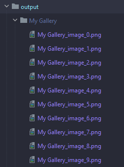

# NFT generative art using Python PIL
 
 - Example of use:            


```python main.py -n 10 --c "My Gallery"```
(n = number of images, c = collection name)

Then, a output folder/collection folder will be created with the arts inside

.


_output path_


 
 
 
 _example of arts generated_ 
 

